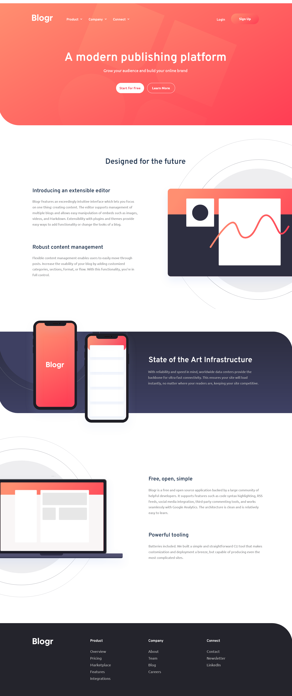

# Blogr landing page solution

This is a solution to the [Blogr landing page challenge on Frontend Mentor](https://www.frontendmentor.io/challenges/blogr-landing-page-EX2RLAApP).

### The challenge

Users should be able to:

- View the optimal layout for the site depending on their device's screen size
- See hover states for all interactive elements on the page

### Screenshot

### Links

- Solution URL: [Repo](https://github.com/karinaestaba/blogr-landing-page)
- Live Site URL: [Demo](https://karinaestaba.github.io/blogr-landing-page)

### Built with

- Semantic HTML5 markup
- CSS custom properties
- Flexbox
- CSS Grid
- Mobile-first workflow

## Author

- Website - [Karina Estaba]()
- Frontend Mentor - [@karinaestaba](https://www.frontendmentor.io/profile/karinaestaba)